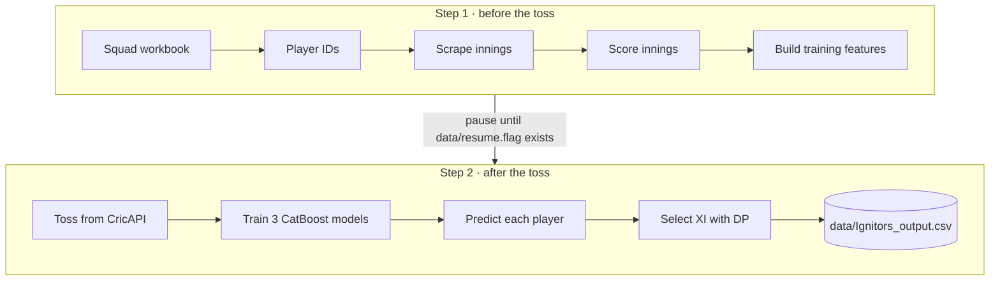

<div align="center">

# 🏏 IPL Fantasy XI Predictor

**Predicts the highest-scoring Dream11 team for any IPL 2025 match**

[](https://github.com/Ak2005github/fantasy_team_predictor_python/actions/workflows/ci.yml)


🏆 National winners of **FIFS Gameathon 2.0** by Dream11 (top 10 of 650+ teams), as team **Ignitors**

</div>

---

## Overview

Picking a fantasy XI means predicting how 22+ players will perform and then fitting the best of them into a 100-credit budget under strict role rules. This project automates the whole process:

| Stage | What it does |
|---|---|
| **Collects** | each player's innings-by-innings T20 history from four public sources |
| **Scores** | every past innings with Dream11's T20 points system |
| **Predicts** | each player's points for the upcoming match with three CatBoost models |
| **Optimizes** | the XI with an exact dynamic-programming knapsack, then names captain and vice-captain |

## How it works

Lineups and the toss are announced only shortly before a match, so the pipeline runs in two steps.



**Data sources**

| Source | Used for |
|---|---|
| ESPNcricinfo Statsguru | player IDs, batting, bowling and fielding history, ground names |
| Cricbuzz | season fixtures and match dates |
| CricAPI | match details, venue and toss result |
| Wikipedia | team name to team code mapping |

**Models.** Three CatBoost regressors predict fantasy points for batters and keepers, bowlers, and all-rounders. Features describe recent form over the last 2 to 6 innings, record at the match venue, and batting or bowling order (innings 1 or 2) from the toss. Each training row uses only innings played before it, so the models never see the future.

**Team rules enforced by the optimizer**

| Constraint | Limit |
|---|---|
| Players | exactly 11 |
| Credits | at most 100 |
| Batters | 1 to 8 |
| Wicketkeepers | 1 to 8 |
| All-rounders | 1 to 4 |
| Bowlers | 1 to 4 |
| Teams | at least one player from each side |
| Captain and vice-captain | the two highest predicted scorers |

<details>
<summary><b>Fantasy points system used</b></summary>

| Batting | Points | Bowling | Points | Fielding | Points |
|---|---|---|---|---|---|
| Run | +1 | Wicket (not run out) | +30 | Catch | +8 |
| Four | +4 | Bowled or LBW bonus | +8 | Every 3 catches | +4 |
| Six | +6 | 3 / 4 / 5 wicket haul | +4 / +8 / +12 | Stumping | +12 |
| 25 / 50 / 75 / 100 runs | +4 / +8 / +12 / +16 | Maiden over | +12 | | |
| Duck (dismissed) | -2 | Economy below 5 to above 12 (min 2 overs) | +6 to -6 | | |
| Strike rate above 170 to below 50 (min 11 balls) | +6 to -6 | Dot balls (estimated) | +1 each, up to 24 | | |

Only the highest run milestone and the highest wicket haul bonus count.

</details>

## Project structure

```
fantasy_team_predictor_python/
├── fantasy_predictor/              Pipeline package, one module per stage
│   ├── __main__.py                 Command-line entry point
│   ├── pipeline.py                 Runs step 1 and step 2 in order
│   ├── config.py                   File paths, URLs and the API key setting
│   ├── net.py                      HTTP requests with timeouts and retries
│   │
│   ├── squad.py                    Cleans the squad workbook
│   ├── player_ids.py               Matches each player to an ESPNcricinfo ID
│   ├── scraper.py                  Downloads each player's innings history
│   ├── scoring.py                  Dream11 fantasy points rules
│   ├── cleaning.py                 Gives every player file the same columns and dates
│   ├── grounds.py                  Builds the venue lookup table
│   ├── substitutes.py              Adds zero-point rows for matches a player sat out
│   ├── schedule.py                 Season fixtures and team codes
│   ├── cricapi.py                  Match, venue and toss details
│   ├── cricket.py                  Overs-to-balls, toss and innings helpers
│   │
│   ├── features_training.py        Features for training the models
│   ├── features_prediction.py      Features for the upcoming match
│   ├── models.py                   Trains the 3 CatBoost models and predicts points
│   └── optimizer.py                Selects the XI, captain and vice-captain
│
├── tests/
│   ├── test_scoring.py             Fantasy points rules
│   ├── test_optimizer.py           Team selection, checked against brute force
│   ├── test_cricket.py             Toss and innings helpers
│   ├── test_cricapi.py             Match lookups
│   ├── test_end_to_end.py          Whole pipeline, run offline
│   └── fake_web.py                 Offline stand-in for the four websites
│
├── data/                           Squad workbook: squads and playing XIs, one sheet per match
│   └── SquadPlayerNames_IndianT20League.xlsx
├── Final_id_data_all.csv           Player name to ESPNcricinfo ID
├── ipl_2025_matches.csv            Season fixtures as scraped
├── ipl_2025_matches_corrected.csv  Fixtures with match numbers (playoffs are 71 to 74)
├── ipl_match_dates.csv             Match number to date
├── ipl_2025_points_table.csv       Team names and codes
│
├── legacy/                         Original single-script version, kept for reference
├── .github/workflows/ci.yml        Runs lint and all tests on every push and pull request
├── Dockerfile                      Container image for the pipeline
├── requirements.txt                Runtime dependencies (pinned)
├── requirements-dev.txt            Adds test and lint tools
└── pytest.ini                      Test settings
```

**Files created when the pipeline runs** (ignored by git)

| Path | Contents |
|---|---|
| `Data_players/<player_id>/` | each player's scored innings and feature files |
| `merged_bat_bhav.csv`, `merged_bowl_bhav.csv`, `merged_combined.csv` | training tables for the three models |
| `sort_gr_coun_full_name.csv` | venue lookup table |
| `data/Ignitors_output.csv` | **the predicted XI with captain (C) and vice-captain (VC)** |

> The pipeline also rewrites the squad workbook and the fixture CSVs in place. To restore the committed versions, run `git checkout -- data Final_id_data_all.csv ipl_*.csv`.

## Getting started

Requires Python 3.11 and a CricAPI key.

```bash
git clone https://github.com/Ak2005github/fantasy_team_predictor_python.git
cd fantasy_team_predictor_python
pip install -r requirements.txt
export CRICAPI_KEY=<your CricAPI key>
```

The key is read from the environment and is never stored in the code.

## Usage

```bash
python -m fantasy_predictor 30
```

1. Step 1 runs and prints `STEP 1 COMPLETE`, then waits.
2. Once the toss is announced, release step 2 from a second terminal:
   ```bash
   touch data/resume.flag
   ```
3. The predicted team is saved to `data/Ignitors_output.csv`:
   ```
   Player name,Team,C/VC
   <player>,<team>,C
   <player>,<team>,VC
   <player>,<team>,
   ... (11 rows)
   ```

### With Docker

```bash
docker build -t fantasy-predictor .
docker run --name ipl30 -e CRICAPI_KEY=<your key> fantasy-predictor 30
docker exec ipl30 touch data/resume.flag          # after the toss
docker cp ipl30:/app/data/Ignitors_output.csv .
```

## Testing

```bash
pip install -r requirements-dev.txt
pytest -m "not slow"    # 68 unit tests, about 1 second
pytest -m slow          # full pipeline end to end, about 3 minutes
```

The end-to-end test replaces the four websites with `tests/fake_web.py` and runs in a temporary copy of the data, so it needs no network access or API key and never modifies the repository's files.

## Author

**Akshith Kasimsetty** · IIT (BHU) Varanasi · [akshith0104@gmail.com](mailto:akshith0104@gmail.com)
